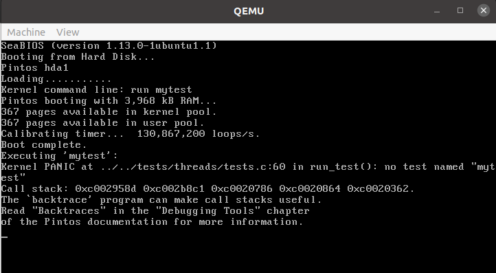
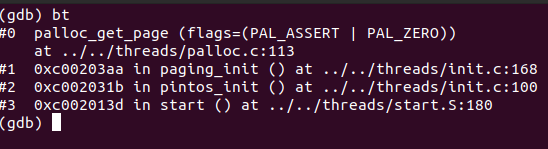
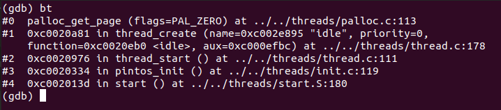
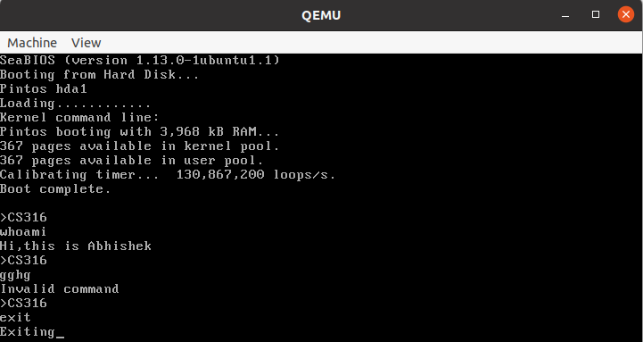

# Project 0: Getting Real

## Exercise 1: Booting PintOS

After generating the kernal image in the threads folder, the 'pintos --gdb -- run mystest' command was executed. Subsequently, in another other terminal, the pintos wrapper for gdb, 'pintos-gdb' was executed and connection to QEMU was established using the 'debugpintos' macro.




## Exercise 2: Debugging

### What is the first instruction that gets executed

```c
ljmp   $0x3630,$0xf000e05b
```
ljmp stands for "long jump". It's used to transfer control to a different code segment. The effect is to jump to the absolute address 0x3630:f000e05b in memory.

### At which physical address is the instruction located?
The instruction is located at 0xffff0.

### Can you guess why the first instruction is like this?
The instruction provided is located at reset vector. Its purpose is to immediately jump to the actual starting point of the BIOS code.In many x86 systems, the top 64KB of the fourth gigabyte of memory(from 0xF0000 to 0xFFFFF) is reserved for the BIOS. The jump target (0xF000:E05B) falls within this range.

## Exercise 3: Debugging Bootloader

### How does the bootloader read disk sectors? In particular, what BIOS interrupt is used?

The 'read_sector' function is used to scan sectors. 

```c
mov $0x80, %dl           # Hard disk 0.
sub %ebx, %ebx           # Sector 0.
mov $0x2000, %ax         # Use 0x20000 for buffer.
mov %ax, %es
```

The above code is setting up parameters required for read operation. 

```c
push $16             # Packet size (16 bytes)
push $1              # Number of sectors to read
push %ax             # Buffer offset (always 0)
push %es             # Buffer segment
push %ebx            # LBA sector number [0:31]
push %ax             # LBA sector number [32:47]
push %ax             # LBA sector number [48:63]
```
Here, the stack is prepared with data required by the interrupt handler to perform read. It gives the number of sectors to read and what memory location to write it to.

```c
mov $0x42, %ah       # Extended read function
mov %sp, %si         # DS:SI points to the packet
int $0x13            # Call BIOS interrupt
```
Finally, interrupt 0x13 is invoked with 0x42(extended read) passed as argument.

### How does the bootloader decides whether it finds the Pintos kernel?

```c
cmpb $0x80, %es:(%si)
je load_kernel
```
This code is searching for a partition that is:

-Used (non-zero first 4 bytes)
-A Pintos kernel partition (type 0x20)
-Bootable (flag 0x80)
If all these conditions are met, it proceeds to load the kernel from this partition.

### What happens when the bootloader could not find the Pintos kernel?
If the kernel is not found in any of the partitions/drives, error message is reported via serial port and BIOS is notified.

### At what point does the bootloader transfer control to the Pintos kernel?
In the load_kernel function, an offset into the kernel elf will give the start address.
```c
mov %es:0x18, %dx
```
The address is stored in a variable called start and a long jump to that address is done
```c
ljmp *start
```

### At the entry of pintos_init(), what is the value of expression init_page_dir[pd_no(ptov(0))] in hexadecimal format?

The value is 0x0. The gdb command *p init_page_dir[pd_no(ptov(0))]* was used.

### When palloc_get_page() is called for the first time,
### 1.what does the call stack look like?
### 2.what is the return value in hexadecimal format?
### 3.what is the value of expression init_page_dir[pd_no(ptov(0))] in hexadecimal format?

1. 
2. The return type is int32_t. Command used was *ptype $eax*.
3. The value is 0x0

### When palloc_get_page() is called for the third time,

1. 
2. Value returned is 0xc0103000.
3. The value is 1056807.

## Exercise 4

### Implementing a kernel shell

A small shell was incorporated into the kernel. It can handle only two commands: 'whoami' and 'exit'.

```c
while(true)
    {
    	int i = 0;
	char c;
	char command[MAX_COMMAND_LENGTH];
	printf("\n>CS316\n");
	while ((c = input_getc()) != '\n' && c != '\r' && i < MAX_COMMAND_LENGTH - 1) {
	  command[i++] = c;
	  putchar(c);  // Echo the character back to the console
	}
	command[i] = '\0';  // Null-terminate the string
	
	if(strcmp(command, "whoami") == 0)
	{
	   printf("\nHi,this is Abhishek");
	}
	else if(strcmp(command, "exit") == 0)
	{
	   printf("\nExiting");
	   intr_enable();
	   break;
	}
	else
	{
	   printf("\nInvalid command");
	}
    }
```



## References
- https://www.cs.jhu.edu/~huang/cs318/fall21/project/pintos_2.html#SEC24
