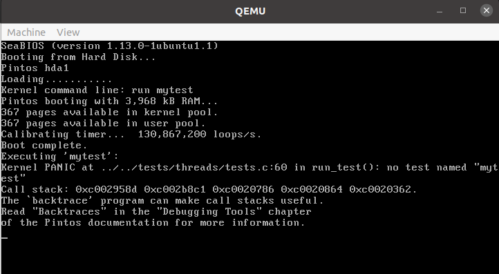

# Project 0: [Getting Real]

## Exercise 1: [Booting PintOS]

### Answer
[After generating the kernal image in the threads folder, the 'pintos --gdb -- run mystest' command was executed. Subsequently, in another other terminal, the pintos wrapper for gdb, 'pintos-gdb' was executed and connection to QEMU was established using the 'debugpintos' macro.]

## Exercise 2: [Exercise Name]

### Question
[Copy the exercise question here]

### Answer
[Your detailed answer to the exercise]

## Additional Notes
[Any extra observations, challenges faced, or interesting points about the project]

## References
- [Link to relevant Pintos documentation]
- [Other resources used]
